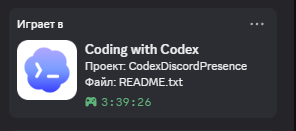

<div align="center">

# Codex Discord Presence

**Native Discord Rich Presence for the ChatGPT Codex desktop app on Windows.**

[](https://github.com/trifonovsdev/codex-discord-presence)
[](https://nodejs.org)
[](https://github.com/trifonovsdev/codex-discord-presence/actions/workflows/ci.yml)
[](LICENSE)



</div>

Shows the **currently selected Codex project**, the **last edited file**, and one stable timer for the entire ChatGPT/Codex desktop session. Switching tasks, projects, or files does not reset the timer.

## Highlights

- Uses the real task selected in Codex Desktop instead of the most recently active background task.
- Tracks edited files from Codex transcripts and lifecycle hooks.
- Keeps one elapsed timer from the moment the desktop app was launched.
- Supports local Windows workspaces and optional SSH/remote workspaces.
- Runs quietly in the background and reconnects to Discord automatically.
- Zero npm dependencies, no bot token, no Discord account token, and no telemetry.
- Installs and uninstalls without replacing unrelated Codex hooks.

## Requirements

- Windows 10 or 11
- [Discord Desktop](https://discord.com/download)
- ChatGPT/Codex Desktop
- [Node.js 18+](https://nodejs.org)
- PowerShell 5.1 or newer

## Quick start

```powershell
git clone https://github.com/trifonovsdev/codex-discord-presence.git
cd codex-discord-presence
powershell -ExecutionPolicy Bypass -File .\install.ps1
```

Restart ChatGPT/Codex once after installation so it reloads `hooks.json`. Keep Discord Desktop open and make sure **Activity Privacy → Share your detected activities with others** is enabled.

The included Discord Application ID is shared by every installation, so friends do **not** need to create their own Discord Developer application.

## Remote workspaces over SSH

Remote file tracking is opt-in. It reads only the transcript for the selected task and keeps an incremental offset cache on the remote machine.

```powershell
.\setup-remote.ps1 -HostName user@your-server
```

SSH key authentication and Python 3 are required on the remote host. You can also configure remote support during installation:

```powershell
.\install.ps1 -RemoteHost user@your-server
```

## Configuration

Configuration is stored at:

```text
%LOCALAPPDATA%\OpenAI\CodexDiscordPresence\config.json
```

| Field | Default | Purpose |
|---|---:|---|
| `clientId` | `1526968377048956938` | Shared Discord application |
| `port` | `37642` | Localhost health and hook server |
| `largeImageKey` | `codex` | Discord Developer Portal asset key |
| `appProcess` | `ChatGPT` | Process used for app lifetime and timer |
| `remote.host` | empty | Optional SSH destination |
| `remote.pollIntervalMs` | `7000` | Remote transcript refresh interval |

After editing the configuration, rerun `install.ps1` or sign out and back into Windows.

## Useful commands

```powershell
# Inspect the live state
.\status.ps1

# Update an existing installation after pulling changes
.\install.ps1

# Remove the daemon, startup entry, and only this project's hooks
.\uninstall.ps1
```

The local health endpoint is `http://127.0.0.1:37642/health`. Logs are stored beside the installed daemon in `presence.log`.

## How it works

```text
Codex Desktop logs ─┐
Codex hooks ────────┼─> local daemon ─> Discord IPC ─> Rich Presence
Task transcripts ──┘        │
                            └─ optional SSH helper for remote tasks
```

The daemon binds only to `127.0.0.1`. It never uploads source code, prompts, transcripts, Discord credentials, or telemetry. The Discord Application ID is public by design and is not a secret.

<details>
<summary><strong>Краткая инструкция на русском</strong></summary>

1. Установи Node.js 18+, Discord Desktop и ChatGPT/Codex Desktop.
2. Клонируй репозиторий и запусти `install.ps1` из PowerShell.
3. Один раз перезапусти ChatGPT/Codex.
4. Для удалённого проекта выполни `setup-remote.ps1 -HostName user@server`.

Presence показывает выбранный проект, последний изменённый файл и общее время текущего запуска Codex. При переключении проекта таймер не сбрасывается.

</details>

## Troubleshooting

- **No presence:** open Discord Desktop before Codex and check Discord Activity Privacy.
- **Image is missing:** the shared application must contain an asset with the `codex` key; leave the default config unchanged.
- **Project is correct but file is blank:** edit a file through a Codex tool once; read-only tasks have no edited file.
- **Remote files are missing:** run `setup-remote.ps1`, verify `ssh -T user@server`, and check `status.ps1` for `lastRemoteError`.
- **Port is busy:** choose another port in `config.json`; the hook reads the same config automatically.

## Contributing

Issues and pull requests are welcome. See [CONTRIBUTING.md](CONTRIBUTING.md) and [SECURITY.md](SECURITY.md).

## Disclaimer

This is an unofficial community project and is not affiliated with or endorsed by OpenAI or Discord. Codex, ChatGPT, OpenAI, and Discord are trademarks of their respective owners.

Released under the [MIT License](LICENSE).
