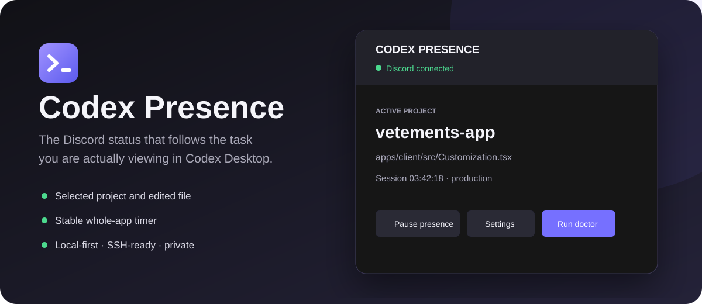
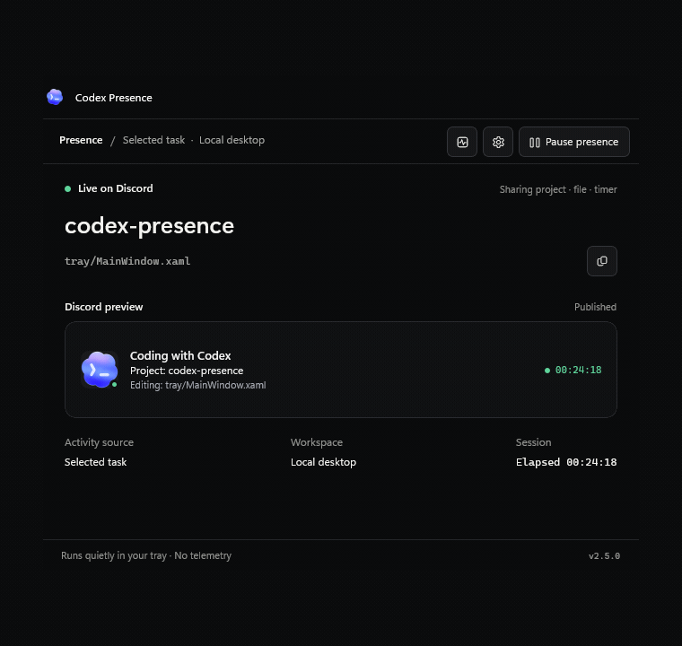

<div align="center">



# Codex Presence

**A local-first WinUI 3 Discord Rich Presence companion for Codex Desktop on Windows.**

[](https://github.com/trifonovsdev/codex-discord-presence/releases/latest)
[](https://github.com/trifonovsdev/codex-discord-presence/actions/workflows/ci.yml)
[](https://github.com/trifonovsdev/codex-discord-presence/releases/latest)
[](LICENSE)

[Download Setup](https://github.com/trifonovsdev/codex-discord-presence/releases/latest/download/CodexPresenceSetup.exe) · [Portable build](https://github.com/trifonovsdev/codex-discord-presence/releases/latest) · [Report a bug](https://github.com/trifonovsdev/codex-discord-presence/issues)

</div>

Codex Presence follows the task selected in ChatGPT/Codex Desktop, detects its project and most recently edited file, and mirrors that activity to Discord. Background tasks cannot silently replace the card, and switching projects never resets the whole-app timer.

## Why this one

- **Selected-task accurate** — follows the task visible in Codex Desktop, not simply the newest transcript.
- **One-click setup** — the installer includes the Windows UI, daemon, and Node runtime.
- **Stable session timer** — project, file, and task changes do not reset elapsed time.
- **Remote-aware** — maps multiple SSH servers to workspace roots.
- **Private by default** — no telemetry, tokens, prompt uploads, or cloud relay. The local service refuses any request a web page could send.
- **Native Fluent UI** — WinUI 3, Mica, system controls, keyboard navigation, privacy presets, diagnostics, and verified updates.
- **English or Russian card** — the text published to Discord follows **Settings → General → Card language**.

## Current highlights

- The dashboard, Settings, Doctor, and dialogs use one accessible graphite design system built on WinUI 3, Fluent controls, and Windows contrast-theme colors.
- Route changes now require nearby workspace evidence, so sidebar/background tasks cannot steal the active Discord card.
- Task titles are opt-in through `privacy.showTaskTitle` and remain hidden by default.
- When no project can be resolved, the Discord card uses an honest generic Codex fallback instead of inventing a local project.
- Remote project detection resolves repositories below account roots without exposing the account name or cached paths to other users.

## Install

1. Download [`CodexPresenceSetup.exe`](https://github.com/trifonovsdev/codex-discord-presence/releases/latest/download/CodexPresenceSetup.exe).
2. Run the installer and keep **Start with Windows** enabled.
3. Restart ChatGPT/Codex once so it reloads its hooks.
4. Keep Discord Desktop open and enable **Activity Privacy → Share your detected activities**.

The shared Discord Application ID is `1526968377048956938`. Friends do not need a Developer Portal account or their own application.

> Community builds are currently unsigned and can trigger Windows SmartScreen. The release workflow is ready for Authenticode signing when a certificate is configured.

## Interface

<div align="center">
  
</div>

Double-click the tray icon to open the dashboard. A native Windows notification-area menu offers pause/resume, settings, diagnostics, update checks, service restart, and clean shutdown. Closing the WinUI window keeps the presence service running.

## Privacy presets

| Preset | Project | Task title | File | Timer | Tooltip | Best for |
|---|:---:|:---:|:---:|:---:|:---:|---|
| `minimal` | ✓ | hidden | hidden | ✓ | app name | Streaming and maximum privacy |
| `standard` | ✓ | hidden | relative path | ✓ | app name | Everyday use |
| `detailed` | ✓ | hidden | relative path | ✓ | app name + workspace | A more descriptive card |

A preset sets the baseline; every individual field can still be overridden, in the UI or by hand in `config.json`. File display supports filename-only or a repository-relative path.

## SSH workspaces

Open **Settings → SSH workspaces** and add one row per server:

| Name | Host | Workspace roots |
|---|---|---|
| Production | `dev@example.com` | `/srv/store; /srv/api` |
| Homelab | `root@10.0.0.5` | `/root/projects` |

Press **Test SSH**, then **Install helper**. Key-based authentication and Python 3 are required remotely. The longest matching workspace root selects the server.

The helper reads only the selected task, stores an incremental byte offset, and returns project, working directory, and latest edited file over the existing SSH connection.

## Doctor

Doctor checks configuration, bundled runtime files, daemon health, Discord IPC, ChatGPT/Codex detection, hooks, Windows startup, and configured SSH hosts. Reports are copyable; review local paths and hostnames before sharing them publicly.

## Updates and integrity

The tray client checks public GitHub Releases, downloads the setup, verifies it against `SHA256SUMS.txt`, and only then launches the silent upgrade. Automatic checks can be disabled in Settings.

Each release contains:

- `CodexPresenceSetup.exe` — one-click installer;
- `CodexPresence-<version>-portable.zip` — portable bundle;
- `SHA256SUMS.txt` — integrity manifest.

## Architecture

```text
Codex route logs ────────┐
Codex lifecycle hooks ───┼──> local daemon ──> Discord IPC
Selected session JSONL ──┘         ▲
                                   │ localhost only
WinUI 3 tray UI ── settings / doctor / controls / updates
                                   │
Selected remote task ── system OpenSSH ──> incremental Python helper
```

The daemon is split into focused modules under `src/`: `config.js` (validation and atomic writes),
`discord-ipc.js` (framing, keepalive, reconnect and rate limiting), `codex-paths.js` (project and file
heuristics), `desktop-selection.js` (which task is selected), `codex-state.js` (read-only selected-task metadata), `presence.js` (card text) and `logger.js`
(rotating log). `daemon.js` wires them to the HTTP control surface.

The local server binds only to `127.0.0.1`, requires a loopback `Host` header, and rejects any request
carrying browser `Origin`/`Sec-Fetch-Site` metadata — so no web page can read your activity or pause the
service. The Discord Application ID is public by design and is not a credential.

## Configuration

Installed configuration:

```text
%LOCALAPPDATA%\Programs\CodexPresence\app\config.json
```

The Settings UI writes this file atomically. Advanced users may edit it manually and restart the service from
the tray menu — see [`config.example.json`](config.example.json) for every key. Invalid values are replaced by
their default and reported in **Doctor** instead of preventing the service from starting.

<details>
<summary><strong>Кратко на русском</strong></summary>

Скачай `CodexPresenceSetup.exe`, установи и один раз перезапусти ChatGPT/Codex. Приложение появится в трее и автоматически запустит Discord Rich Presence.

- `minimal` скрывает имя файла;
- `standard` показывает проект и относительный путь;
- общий таймер не сбрасывается при переключении задач;
- язык карточки в Discord переключается в **Settings → General → Card language** (English / Русский);
- SSH-серверы настраиваются в **Settings → SSH workspaces**;
- **Doctor** проверяет установку и объясняет, что именно не работает.

</details>

## Development

Requirements: Windows, .NET 8 SDK, Node.js 24+, Python 3, and Inno Setup 6.7.3. Windows App SDK 2.4 is restored from NuGet.

```powershell
git clone https://github.com/trifonovsdev/codex-discord-presence.git
cd codex-discord-presence
npm run check
dotnet build .\tray\CodexPresence.Tray.csproj -c Release
.\build-release.ps1 -Version 2.3.4
```

The build downloads the pinned official Node distribution, verifies its archive against both the reviewed SHA-256 pinned in the build script and Node.js `SHASUMS256.txt`, publishes a self-contained unpackaged WinUI app, compiles the installer, and emits SHA-256 checksums. Verified downloads are cached under `.build-cache/`.

`npm run check` runs the whole JavaScript suite — the path heuristics are pinned to Windows semantics, so the
tests give identical results on Linux and macOS. WinUI compilation and the installed-app smoke test run on
Windows CI; building or running the desktop shell locally requires Windows.

### Release signing

The release workflow signs the executable, uninstaller, and setup when these GitHub Actions secrets are configured:

- `CODE_SIGN_PFX_BASE64`
- `CODE_SIGN_PFX_PASSWORD`

## Security and contributing

Read [SECURITY.md](SECURITY.md) before reporting a vulnerability. Issues and focused pull requests are welcome; see [CONTRIBUTING.md](CONTRIBUTING.md).

This is an unofficial community project and is not affiliated with or endorsed by OpenAI or Discord. Released under the [MIT License](LICENSE).
