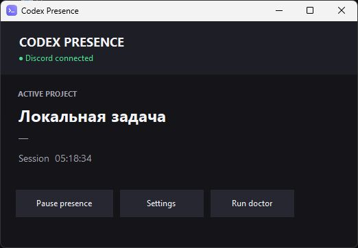
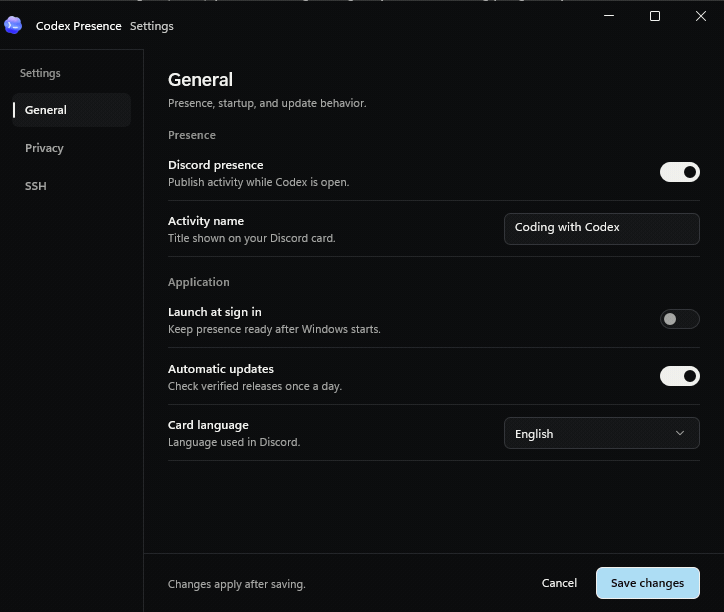
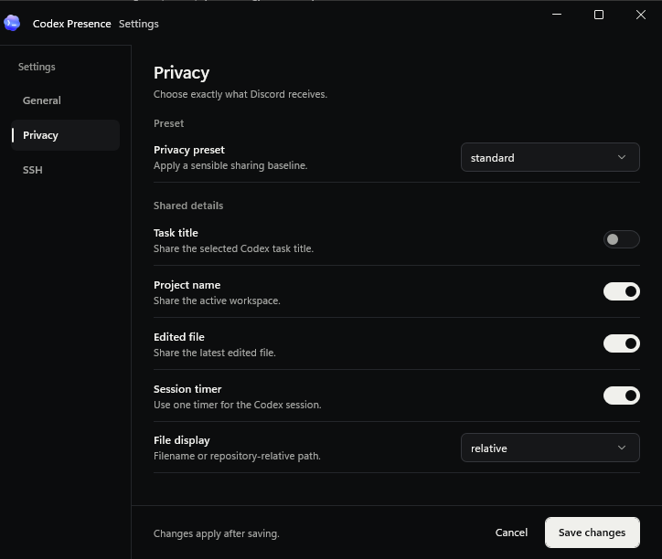
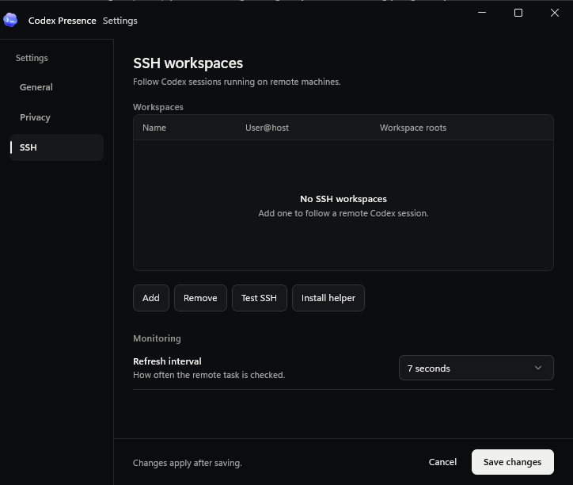

<div align="center">

# Codex Presence

**A local-first WinUI 3 Discord Rich Presence companion for Codex Desktop on Windows.**

[](https://github.com/trifonovsdev/codex-discord-presence/releases/latest)
[](https://github.com/trifonovsdev/codex-discord-presence/actions/workflows/ci.yml)
[](https://github.com/trifonovsdev/codex-discord-presence/releases/latest)
[](LICENSE)

[Download Setup](https://github.com/trifonovsdev/codex-discord-presence/releases/latest/download/CodexPresenceSetup.exe) · [Portable build](https://github.com/trifonovsdev/codex-discord-presence/releases/latest) · [Report a bug](https://github.com/trifonovsdev/codex-discord-presence/issues)

</div>

Codex Presence follows the task selected in ChatGPT/Codex Desktop, detects its project and most recently edited file, and mirrors that activity to Discord. Background tasks cannot silently replace the card, and switching projects never resets the whole-app timer.



## Why this one

- **Selected-task accurate** — follows the task visible in Codex Desktop, not simply the newest transcript.
- **One-click setup** — the installer includes the Windows UI, daemon, and Node runtime.
- **Stable session timer** — project, file, and task changes do not reset elapsed time.
- **Remote-aware** — maps multiple SSH servers to workspace roots.
- **Private by default** — no telemetry, tokens, prompt uploads, or cloud relay. The local service refuses any request a web page could send.
- **Native Fluent UI** — WinUI 3, Mica, system controls, keyboard navigation, privacy presets, diagnostics, and verified updates.
- **Real custom activity name** — replace the top-line “Coding with Codex” text through Discord Social SDK in **Settings → General → Activity name**.
- **English or Russian card** — the text published to Discord follows **Settings → General → Card language**.

## Fixed in 2.5.1: in-app updates

Update downloads now stream to disk with a ten-minute deadline, show progress, verify SHA-256, and close the file before launching Setup. The installer stops only Presence and its daemon, avoiding the old recursive shutdown that could kill the installer itself. It updates the current directory, preserves configuration, and explicitly returns the app to the tray after a silent upgrade. Failed API checks no longer appear as “up to date”, and errors after accepting an automatic update are shown too.

If your older build cannot finish updating, [download Setup once](https://github.com/trifonovsdev/codex-discord-presence/releases/latest/download/CodexPresenceSetup.exe) and run it over the existing installation. **Do not uninstall first**; uninstalling removes configuration. Subsequent updates use the repaired updater. Installer logs for new in-app updates are saved under `%TEMP%\CodexPresenceUpdate\<version>\<attempt>\install.log`.

## Fixed in 2.5.2: status and interactions

- **A working service no longer looks offline behind a proxy.** Local status and pause/resume requests connect directly to loopback. HTTP and response errors now appear in Doctor.
- **An unreachable status is unverified.** The dashboard keeps the last confirmed context, freezes its public timer, and retries. Doctor marks dependent Discord checks as unknown instead of suggesting unrelated privacy changes.
- **Native control motion.** Switches use WinUI's sliding thumb and keyboard behavior. Buttons use a single native state transition; the extra whole-button dimming is gone. Settings navigation has one selection layer, so hover cannot leave multiple rows highlighted.
- **Stable layout.** Aligned margins, consistent settings rows, minimum window widths, and copy feedback that does not move the file path. Warnings appear after the preview instead of pushing it down.
- **Useful project names.** Codex visualization, attachment, and session directories are excluded from workspace guesses; real Codex worktrees still work.

The graphite palette and existing page structure are retained.

## Dashboard

- **More room to read:** larger project title, a roomier Discord card, brighter secondary labels, and 34 px compact action targets.
- **Honest publication state:** “Published” appears only after Discord acknowledges the activity. Paused and waiting states say “Not published”; unavailable local status is explicitly “Status unknown” or “Last confirmed”.
- **Useful session context:** activity source, workspace, and elapsed time are visible together. Long project names and paths have tooltips.
- **Predictable controls:** pause/resume shows progress and ignores duplicate requests. Native controls own pointer and keyboard feedback and respect Windows' animation setting. Timer ticks update only time labels; they no longer rebuild the whole presentation.
- **Reproducible previews:** Windows CI renders the actual WinUI screens with synthetic data; no Discord account or private workspace is used.

## Install

1. Download [`CodexPresenceSetup.exe`](https://github.com/trifonovsdev/codex-discord-presence/releases/latest/download/CodexPresenceSetup.exe).
2. Run the installer and keep **Start with Windows** enabled.
3. Restart ChatGPT/Codex once so it reloads its hooks.
4. Keep Discord Desktop open and enable **Activity Privacy → Share your detected activities**.

The shared Discord Application ID is `1526968377048956938`. Friends do not need a Developer Portal account or their own application.

> Community builds are currently unsigned and can trigger Windows SmartScreen. The release workflow is ready for Authenticode signing when a certificate is configured.

## See it in action

<div align="center">
  
</div>

These are captures of the real WinUI application on Windows with **illustrative local data**. The GIF records native switch transitions, including a quick reversal, from the Windows compositor. It does not connect to Discord or measure animation performance on your hardware.

| Choose what you share | Connect SSH workspaces |
|---|---|
|  |  |

Double-click the tray icon to open the dashboard. Use **Pause presence** to stop publishing, **Settings** to choose what is shared, and **Doctor** to diagnose a connection. Closing the window keeps the service running in the notification area.

Keyboard users can Tab through controls and activate buttons with Space or Enter. Settings sections switch immediately; they do not wait for an animation. Windows contrast themes retain their system colors.

## Privacy presets

| Preset | Project | Task title | File | Timer | Tooltip | Best for |
|---|:---:|:---:|:---:|:---:|:---:|---|
| `minimal` | ✓ | hidden | hidden | ✓ | app name | Streaming and maximum privacy |
| `standard` | ✓ | hidden | relative path | ✓ | app name | Everyday use |
| `detailed` | ✓ | hidden | relative path | ✓ | app name + workspace | A more descriptive card |

A preset sets the baseline; every individual field can still be overridden, in the UI or by hand in `config.json`. File display supports filename-only or a repository-relative path.

## SSH workspaces

Open **Settings → SSH workspaces** and add one row per server:

| Name | Host | Workspace roots |
|---|---|---|
| Production | `dev@example.com` | `/srv/store; /srv/api` |
| Homelab | `root@10.0.0.5` | `/root/projects` |

Press **Test SSH**, then **Install helper**. Key-based authentication and Python 3 are required remotely. The longest matching workspace root selects the server.

The helper reads only the selected task, stores an incremental byte offset, and returns project, working directory, and latest edited file over the existing SSH connection.

## Doctor

Doctor checks configuration, bundled runtime files, the Discord Social SDK publisher, ChatGPT/Codex detection, hooks, Windows startup, and configured SSH hosts. Reports are copyable; review local paths and hostnames before sharing them publicly.

## Updates and integrity

The tray client checks public GitHub Releases, downloads the setup, verifies it against `SHA256SUMS.txt`, and only then launches the silent upgrade. Automatic checks can be disabled in Settings.

Each release contains:

- `CodexPresenceSetup.exe` — one-click installer;
- `CodexPresence-<version>-portable.zip` — portable bundle;
- `SHA256SUMS.txt` — integrity manifest.

## Architecture

```text
Codex route logs ────────┐
Codex lifecycle hooks ───┼──> local daemon ──> isolated Social SDK bridge ──> Discord Desktop
Selected session JSONL ──┘         ▲                └─ legacy RPC fallback
                                   │ localhost only
WinUI 3 tray UI ── settings / doctor / controls / updates
                                   │
Selected remote task ── system OpenSSH ──> incremental Python helper
```

The daemon is split into focused modules under `src/`: `config.js` (validation and atomic writes),
`discord-publisher.js` (Social SDK bridge lifecycle, acknowledgement tracking, retries and fallback),
`discord-ipc.js` (legacy framing and keepalive), `codex-paths.js` (project and file
heuristics), `desktop-selection.js` (which task is selected), `codex-state.js` (read-only selected-task metadata), `presence.js` (card text) and `logger.js`
(rotating log). `daemon.js` wires them to the HTTP control surface.

The local server binds only to `127.0.0.1`, requires a loopback `Host` header, and rejects any request
carrying browser `Origin`/`Sec-Fetch-Site` metadata — so no web page can read your activity or pause the
service. The Discord Application ID is public by design and is not a credential.

## Configuration

Installed configuration:

```text
%LOCALAPPDATA%\Programs\CodexPresence\app\config.json
```

The Settings UI writes this file atomically. Advanced users may edit it manually and restart the service from
the tray menu — see [`config.example.json`](config.example.json) for every key. Invalid values are replaced by
their default and reported in **Doctor** instead of preventing the service from starting.

<details>
<summary><strong>Кратко на русском</strong></summary>

Скачай `CodexPresenceSetup.exe`, установи и один раз перезапусти ChatGPT/Codex. Приложение появится в трее и автоматически запустит Discord Rich Presence.

- `minimal` скрывает имя файла;
- `standard` показывает проект и относительный путь;
- общий таймер не сбрасывается при переключении задач;
- строка `Coding with Codex` меняется в **Settings → General → Activity name**;
- язык карточки в Discord переключается в **Settings → General → Card language** (English / Русский);
- SSH-серверы настраиваются в **Settings → SSH workspaces**;
- **Doctor** проверяет установку и объясняет, что именно не работает.

</details>

## Development

Requirements: Windows, .NET 8 SDK, Node.js 24+, Python 3, and Inno Setup 6.7.3. Windows App SDK 2.4 is restored from NuGet.

```powershell
git clone https://github.com/trifonovsdev/codex-discord-presence.git
cd codex-discord-presence
npm run check
dotnet run --project .\tests\presentation\PresentationTests.csproj -c Release
dotnet build .\tray\CodexPresence.Tray.csproj -c Release
.\build-release.ps1 -Version 2.5.2
```

The build downloads the pinned official Node distribution and the pinned Discord Social SDK 1.9.16441 runtime, verifies both native archives against reviewed SHA-256 values, publishes a self-contained unpackaged WinUI app, compiles the installer, and emits SHA-256 checksums. The SDK binary is fetched from a commit-pinned vendor mirror because Discord’s official archive requires an authenticated Developer Portal download; its bundled open-source notices ship as `DISCORD_SOCIAL_SDK_NOTICES.txt`. Verified downloads are cached under `.build-cache/`.

`npm run check` runs the whole JavaScript suite — the path heuristics are pinned to Windows semantics, so the
tests give identical results on Linux and macOS. WinUI compilation and the installed-app smoke test run on
Windows CI; building or running the desktop shell locally requires Windows.

### Reproduce the screenshots

After a Windows build, run the generated `CodexPresence.exe` with:

```powershell
.\CodexPresence.exe --capture-preview C:\Temp\presence-screenshots
```

This writes six PNGs (published, paused, unverified status, and the three Settings sections), native interaction checks, and timestamped motion frames and exits. It starts no daemon, makes no Discord or SSH connections, and does not save configuration. CI uploads these as `native-screenshots` for visual review. Keep the preview window unobstructed while capturing; the images come from the real desktop compositor.

The JavaScript tests validate the daemon, privacy boundaries, and UI contracts. C# test executables exercise presentation states, a real daemon behind a rejecting system proxy, pause/resume, reconnect errors, and verified updater downloads. Windows CI additionally compiles XAML, captures all six screens, exercises repeated tab/toggle changes and minimum-width layouts, and checks C# formatting. Release builds must pass the installer and portable smoke tests before publication. High-DPI interaction, screen-reader behavior, and animation frame times still need checks on physical Windows hardware.

### Release signing

The release workflow signs the executable, uninstaller, and setup when these GitHub Actions secrets are configured:

- `CODE_SIGN_PFX_BASE64`
- `CODE_SIGN_PFX_PASSWORD`

## Security and contributing

Read [SECURITY.md](SECURITY.md) before reporting a vulnerability. Issues and focused pull requests are welcome; see [CONTRIBUTING.md](CONTRIBUTING.md).

This is an unofficial community project and is not affiliated with or endorsed by OpenAI or Discord. The Codex name and app icon belong to OpenAI and are used here only to identify compatibility. Released under the [MIT License](LICENSE).
