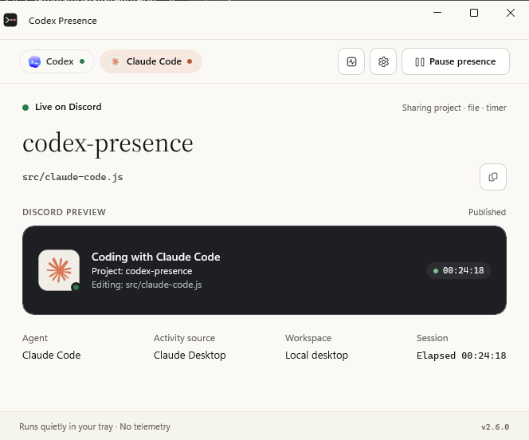
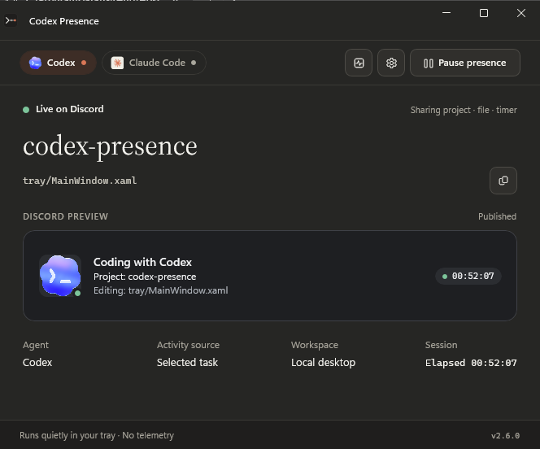
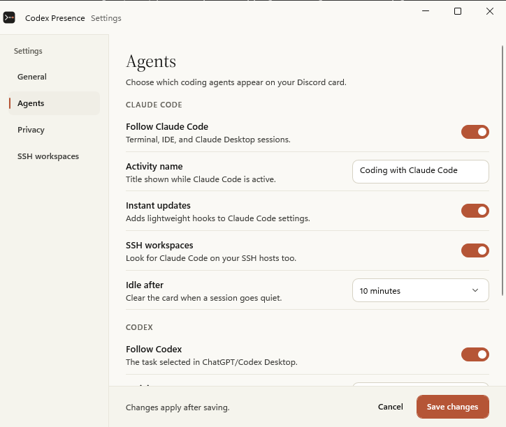
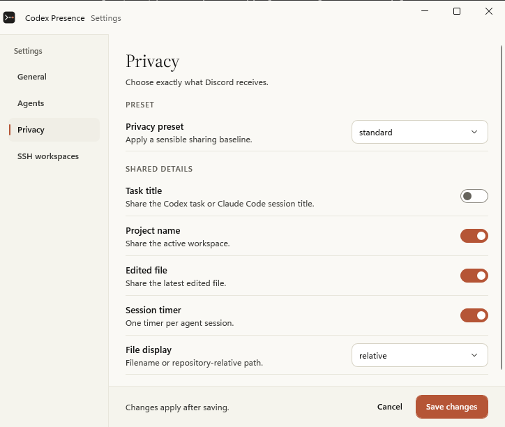
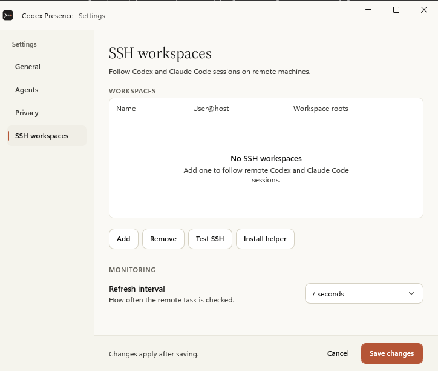

<div align="center">

# Codex Presence

**A local-first Discord Rich Presence companion for Codex and Claude Code on Windows.**

[](https://github.com/trifonovsdev/codex-discord-presence/releases/latest)
[](https://github.com/trifonovsdev/codex-discord-presence/actions/workflows/ci.yml)
[](https://github.com/trifonovsdev/codex-discord-presence/releases/latest)
[](LICENSE)

[Download Setup](https://github.com/trifonovsdev/codex-discord-presence/releases/latest/download/CodexPresenceSetup.exe) · [Portable build](https://github.com/trifonovsdev/codex-discord-presence/releases/latest) · [Report a bug](https://github.com/trifonovsdev/codex-discord-presence/issues)

</div>

Codex Presence mirrors what your coding agent is working on to Discord: the project, the file it just edited, and one steady session timer. It follows the task selected in ChatGPT/Codex Desktop **and** the Claude Code session you are prompting — in the terminal, an IDE, Claude Desktop, or on a server over SSH — and puts whichever you used last on your card.



## Why this one

- **Two agents, one card.** Codex and Claude Code are followed side by side. The one you prompted last owns the card; a background agent that keeps working never takes it over. Prefer one of them in Settings if you like.
- **Follows your focus.** Tracks the active project and edited file while keeping a stable timer; switching tasks or sessions never resets it.
- **Works across SSH workspaces.** Map servers to workspace roots once — remote Codex tasks and remote Claude Code sessions (including those Claude Desktop runs over SSH) are both followed.
- **Keeps you in control.** No telemetry or cloud relay; task and session titles stay private unless enabled. Pause sharing from the tray.
- **Fits Windows.** Native WinUI controls in a warm ivory or slate theme, keyboard navigation, contrast themes, verified updates, and English or Russian Discord cards with custom activity names.

## New in 2.6: Claude Code

- **Claude Code support.** Local sessions are read from `~/.claude` (the live session registry and transcript tails), so the card knows when Claude is working, which repository it is in, and which file it just changed. Worktrees under `.claude/worktrees` resolve to their repository.
- **Instant updates without slowing Claude down.** Optional hooks are added to `~/.claude/settings.json` for prompts, session start/end and file edits only. They deliver one event in under half a second and never retry, so a turn is never blocked; everything else in your settings is preserved and a backup is kept. Uninstalling removes exactly these entries.
- **Remote sessions.** The SSH helper gained a Claude Code mode. Reinstall it once from **Settings → SSH workspaces → Install helper**.
- **A calmer interface.** Ivory and slate themes after Anthropic's palette with a single clay accent, an editorial serif for titles, an agent switcher that shows who owns the card, and a Discord preview that shows exactly what Discord received. Choose **System**, **Light** or **Dark** in Settings.

| Codex in the slate theme | Choose your agents |
|---|---|
|  |  |

## Install

1. Download [`CodexPresenceSetup.exe`](https://github.com/trifonovsdev/codex-discord-presence/releases/latest/download/CodexPresenceSetup.exe).
2. Run the installer and keep **Start with Windows** enabled.
3. Restart ChatGPT/Codex once so it reloads its hooks. Claude Code picks its hooks up in new sessions.
4. Keep Discord Desktop open and enable **Activity Privacy → Share your detected activities**.

The shared Discord Application ID is `1526968377048956938`. Friends do not need a Developer Portal account or their own application.

> Community builds are currently unsigned and can trigger Windows SmartScreen. The release workflow is ready for Authenticode signing when a certificate is configured.

## Using it

| Choose what you share | Connect SSH workspaces |
|---|---|
|  |  |

Double-click the tray icon to open the dashboard. The switcher at the top shows both agents: the filled chip is on your Discord card, a green dot means the other agent is active too. Use **Pause presence** to stop publishing, **Settings** to choose agents and what is shared, and **Doctor** to diagnose a connection. Closing the window keeps the service running in the notification area.

Keyboard users can Tab through controls and activate buttons with Space or Enter. Settings sections switch immediately; they do not wait for an animation. Windows contrast themes retain their system colors.

## Privacy presets

| Preset | Project | Task title | File | Timer | Tooltip | Best for |
|---|:---:|:---:|:---:|:---:|:---:|---|
| `minimal` | ✓ | hidden | hidden | ✓ | app name | Streaming and maximum privacy |
| `standard` | ✓ | hidden | relative path | ✓ | app name | Everyday use |
| `detailed` | ✓ | hidden | relative path | ✓ | app name + workspace | A more descriptive card |

A preset sets the baseline for both agents; every individual field can still be overridden, in the UI or by hand in `config.json`. File display supports filename-only or a repository-relative path; Claude Code edits outside the project are reduced to their last two path segments, and Claude Code's own memory and plan files are never shown.

## Claude Code

Open **Settings → Agents**:

| Setting | Default | What it does |
|---|---|---|
| Follow Claude Code | on | Terminal, IDE extension and Claude Desktop sessions on this PC and, optionally, your SSH hosts |
| Activity name | `Coding with Claude Code` | Title of the Discord card while Claude Code owns it |
| Instant updates | on | Registers four lightweight hooks in `~/.claude/settings.json` (`SessionStart`, `UserPromptSubmit`, `PostToolUse` for edit tools, `SessionEnd`) |
| SSH workspaces | on | Asks each configured SSH host which Claude Code session is focused; idle hosts are polled every 30 s |
| Idle after | 10 minutes | A session with no activity for this long leaves the card; sessions Claude is actively working in always count |
| Show on the card | Most recent | When both agents are active: the one you prompted last, or always prefer Claude Code / Codex |

Focus is inferred from your prompts, because Claude Code has no "selected task": the session that most recently received a message from you is shown. `CLAUDE_CONFIG_DIR` is honored. The Discord artwork is served from this repository (`assets/discord/claude-code.png`); to use an uploaded Rich Presence asset instead, set `agents.claude.largeImageKey` to its key.

## SSH workspaces

Open **Settings → SSH workspaces** and add one row per server. The same rows serve Codex tasks and Claude Code sessions:

| Name | Host | Workspace roots |
|---|---|---|
| Production | `dev@example.com` | `/srv/store; /srv/api` |
| Homelab | `root@10.0.0.5` | `/root/projects` |

Press **Test SSH**, then **Install helper**. Key-based authentication and Python 3 are required remotely. The longest matching workspace root selects the server.

The helper reads only the selected Codex task or the focused Claude Code session, stores an incremental byte offset, and returns project, working directory, and latest edited file over the existing SSH connection. Claude Code mode uses `~/.claude` (or `CLAUDE_CONFIG_DIR`) on the server; hosts without Claude Code simply report no session.

## Doctor

Doctor checks configuration, bundled runtime files, the Discord Social SDK publisher, ChatGPT/Codex and Claude Code detection, both sets of hooks, Windows startup, and configured SSH hosts. Reports are copyable; review local paths and hostnames before sharing them publicly.

## Updates and integrity

The tray client checks public GitHub Releases, downloads the setup, verifies it against `SHA256SUMS.txt`, and only then launches the silent upgrade. Automatic checks can be disabled in Settings.

Each release contains:

- `CodexPresenceSetup.exe` — one-click installer;
- `CodexPresence-<version>-portable.zip` — portable bundle;
- `SHA256SUMS.txt` — integrity manifest.

## Architecture

```text
Codex route logs ─────────┐
Codex lifecycle hooks ────┤
Selected session JSONL ───┤
Claude Code registry ─────┼──> local daemon ──> agent selection ──> Social SDK bridge ──> Discord Desktop
Claude Code transcripts ──┤         ▲                                 └─ legacy RPC fallback
Claude Code hooks ────────┘         │ localhost only
WinUI 3 tray UI ── settings / doctor / controls / updates
                                    │
Remote task / session ── system OpenSSH ──> incremental Python helper
```

The daemon is split into focused modules under `src/`: `config.js` (validation and atomic writes),
`discord-publisher.js` (Social SDK bridge lifecycle, acknowledgement tracking, retries and fallback),
`discord-ipc.js` (legacy framing and keepalive), `codex-paths.js` (project and file
heuristics), `desktop-selection.js` (which task is selected), `codex-state.js` (read-only selected-task metadata),
`claude-code.js` (Claude Code sessions, focus and hooks), `agents.js` (which agent owns the card), `tail.js`
(incremental log reads), `presence.js` (card text) and `logger.js` (rotating log). `daemon.js` wires them to the
HTTP control surface.

The local server binds only to `127.0.0.1`, requires a loopback `Host` header, and rejects any request
carrying browser `Origin`/`Sec-Fetch-Site` metadata — so no web page can read your activity or pause the
service. The Discord Application ID is public by design and is not a credential.

## Configuration

Installed configuration:

```text
%LOCALAPPDATA%\Programs\CodexPresence\app\config.json
```

The Settings UI writes this file atomically. Advanced users may edit it manually and restart the service from
the tray menu — see [`config.example.json`](config.example.json) for every key. Invalid values are replaced by
their default and reported in **Doctor** instead of preventing the service from starting.

<details>
<summary><strong>Кратко на русском</strong></summary>

Скачай `CodexPresenceSetup.exe`, установи и один раз перезапусти ChatGPT/Codex. Приложение появится в трее и автоматически запустит Discord Rich Presence — для Codex и для Claude Code.

- Claude Code отслеживается в терминале, IDE, Claude Desktop и на SSH-серверах; на карточке — тот агент, которому ты писал последним (**Settings → Agents**);
- для удалённых сессий Claude Code один раз переустанови хелпер: **Settings → SSH workspaces → Install helper**;
- тема: **Settings → General → Appearance** (System / Light / Dark);
- `minimal` скрывает имя файла;
- `standard` показывает проект и относительный путь;
- общий таймер не сбрасывается при переключении задач;
- строки `Coding with Codex` и `Coding with Claude Code` меняются в **Settings → Agents**;
- язык карточки в Discord переключается в **Settings → General → Card language** (English / Русский);
- SSH-серверы настраиваются в **Settings → SSH workspaces**;
- **Doctor** проверяет установку и объясняет, что именно не работает.

</details>

## Development

Requirements: Windows, .NET 8 SDK, Node.js 24+, Python 3, and Inno Setup 6.7.3. Windows App SDK 2.4 is restored from NuGet. Brand PNG/ICO files are rendered from `assets/brand/*.svg` with `python tools/render-brand-assets.py`.

```powershell
git clone https://github.com/trifonovsdev/codex-discord-presence.git
cd codex-discord-presence
npm run check
dotnet run --project .\tests\presentation\PresentationTests.csproj -c Release
dotnet build .\tray\CodexPresence.Tray.csproj -c Release
.\build-release.ps1 -Version 2.6.0
```

The build downloads the pinned official Node distribution and the pinned Discord Social SDK 1.9.16441 runtime, verifies both native archives against reviewed SHA-256 values, publishes a self-contained unpackaged WinUI app, compiles the installer, and emits SHA-256 checksums. The SDK binary is fetched from a commit-pinned vendor mirror because Discord’s official archive requires an authenticated Developer Portal download; its bundled open-source notices ship as `DISCORD_SOCIAL_SDK_NOTICES.txt`. Verified downloads are cached under `.build-cache/`.

`npm run check` runs the whole JavaScript suite — the path heuristics are pinned to Windows semantics, so the
tests give identical results on Linux and macOS. WinUI compilation and the installed-app smoke test run on
Windows CI; building or running the desktop shell locally requires Windows.

### Reproduce the screenshots

After a Windows build, run the generated `CodexPresence.exe` with:

```powershell
.\CodexPresence.exe --capture-preview C:\Temp\presence-screenshots
```

This writes eight PNGs (Claude Code and Codex dashboards in both themes, paused, unverified status, and the four Settings sections), native interaction checks, and timestamped motion frames and exits. It starts no daemon, makes no Discord or SSH connections, and does not save configuration. CI uploads these as `native-screenshots` for visual review. This opt-in capture moves the pointer and sends test clicks and keys to the preview, then restores the pointer. Keep the preview window unobstructed and leave the mouse and keyboard idle until it exits; images come from the real desktop compositor.

The JavaScript tests validate the daemon, privacy boundaries, and UI contracts. C# test executables exercise presentation states (including Claude Code), Claude Code hook registration against a real settings file, a real daemon behind a rejecting system proxy, pause/resume, reconnect errors, and verified updater downloads. Windows CI additionally compiles XAML, captures all eight screens, checks real pointer hover at the center and edge, rapid reversals, endpoint color bounds, held-state stability, click cancellation, Space/Enter, repeated tab/toggle changes, and minimum-width layouts, and checks C# formatting. Release builds must pass the installer and portable smoke tests before publication. High-DPI interaction, screen-reader behavior, and animation frame times still need checks on physical Windows hardware.

### Release signing

The release workflow signs the executable, uninstaller, and setup when these GitHub Actions secrets are configured:

- `CODE_SIGN_PFX_BASE64`
- `CODE_SIGN_PFX_PASSWORD`

## Security and contributing

Read [SECURITY.md](SECURITY.md) before reporting a vulnerability. Issues and focused pull requests are welcome; see [CONTRIBUTING.md](CONTRIBUTING.md).

This is an unofficial community project and is not affiliated with or endorsed by OpenAI, Anthropic, or Discord. The Codex name and app icon belong to OpenAI, and the Claude name and symbol belong to Anthropic; both are used here only to identify compatibility. Titles use Source Serif 4 under the [SIL Open Font License](assets/fonts/SourceSerif4-OFL.md). Released under the [MIT License](LICENSE).
